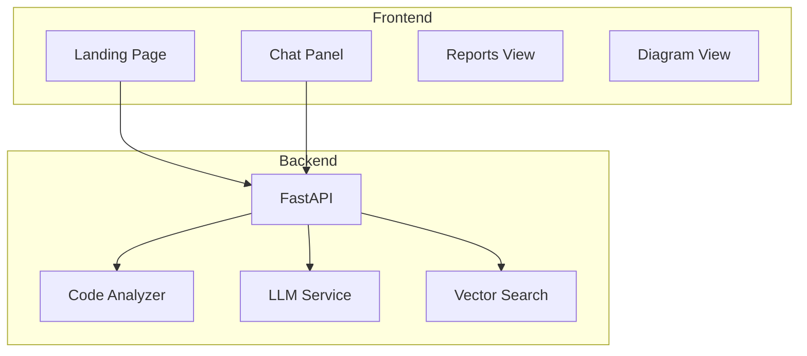

# CodeCompass Landing Page - Product Requirements Document

## Document Info
| Field | Value |
|-------|-------|
| **Version** | 1.0 |
| **Status** | Draft |
| **Author** | Product Manager |
| **Last Updated** | 2026-01-10 |

---

## 1. Executive Summary

The CodeCompass landing page serves as the primary interface for users to onboard codebases and interact with the AI-powered analysis system. This document defines the requirements, user stories, and design specifications for a modern, intuitive landing page that follows industry best practices.

---

## 2. Goals & Objectives

### Primary Goals
1. **Frictionless Onboarding**: Allow users to add a codebase in under 30 seconds
2. **Immediate Value**: Show analysis results and enable chat as quickly as possible
3. **Professional UX**: Match the quality of leading developer tools (VS Code, GitHub, Linear)

### Success Metrics
| Metric | Target |
|--------|--------|
| Time to first project added | < 30 seconds |
| Time to first chat interaction | < 2 minutes (after analysis) |
| User drop-off during onboarding | < 10% |
| Task completion rate | > 95% |

---

## 3. User Personas

### Primary: Developer (New to Codebase)
- **Goal**: Quickly understand an unfamiliar codebase
- **Behavior**: Wants to ask questions immediately, prefers chat over reading docs
- **Pain Points**: Overwhelmed by large codebases, documentation is outdated

### Secondary: Tech Lead / Architect
- **Goal**: Get high-level overview for decision-making
- **Behavior**: Wants visual diagrams, dependency analysis, architecture reports
- **Pain Points**: No time to read every file, needs big-picture understanding

### Tertiary: Solo Developer
- **Goal**: Document own codebase, get AI assistance
- **Behavior**: Works locally, prefers folder selection over git URLs
- **Pain Points**: Forgot how old code works, needs quick refresher

---

## 4. User Stories

### Epic 1: Project Onboarding

#### US-1.1: Add Project via Git URL
**As a** developer
**I want to** enter a git repository URL
**So that** I can analyze a remote codebase without cloning it manually

**Acceptance Criteria:**
- [ ] Input field accepts valid git URLs (https://, git@)
- [ ] Supports GitHub, GitLab, Bitbucket, and generic git URLs
- [ ] Shows validation feedback for invalid URLs
- [ ] Displays clone progress with percentage indicator
- [ ] Handles authentication for private repos (via stored credentials or prompt)
- [ ] Allows branch selection (default: main/master)
- [ ] Shows estimated clone time for large repos

**Edge Cases:**
- Invalid URL format → Show inline error "Please enter a valid git URL"
- Private repo without auth → Prompt for credentials or SSH key
- Network timeout → Show retry option with error message
- Repo too large (>1GB) → Show warning with proceed/cancel option

---

#### US-1.2: Add Project via Local Folder
**As a** developer
**I want to** select a folder from my local filesystem
**So that** I can analyze code I already have on my machine

**Acceptance Criteria:**
- [ ] "Open Folder" button triggers native file picker dialog
- [ ] Validates selected folder contains code files (not empty/binary only)
- [ ] Detects if folder is a git repository and shows branch info
- [ ] Respects .gitignore patterns for file exclusion
- [ ] Shows folder path after selection with option to change
- [ ] Handles symlinks gracefully

**Edge Cases:**
- Empty folder → Show message "No code files found in this folder"
- No read permission → Show error "Cannot access this folder"
- Folder with only binary files → Show warning "No source code detected"

---

#### US-1.3: View Onboarding Progress
**As a** user
**I want to** see the progress of project analysis
**So that** I know how long to wait and what's happening

**Acceptance Criteria:**
- [ ] Multi-step progress indicator (Clone → Analyze → Index → Ready)
- [ ] Each step shows sub-progress (e.g., "Analyzing file 45/230")
- [ ] Estimated time remaining displayed
- [ ] Can minimize progress and continue browsing
- [ ] Notification when analysis completes
- [ ] Error state shows what went wrong with retry option

**Progress Steps:**
1. **Cloning** (git URL only): "Cloning repository... 45%"
2. **Scanning**: "Scanning files... 120 files found"
3. **Analyzing**: "Analyzing code structure... 67%"
4. **Generating Reports**: "Creating architecture report..."
5. **Indexing**: "Building search index... 89%"
6. **Ready**: "Analysis complete! You can now chat and explore."

---

### Epic 2: Chat Interface

#### US-2.1: Ask Questions About Codebase
**As a** developer
**I want to** ask natural language questions about the code
**So that** I can quickly understand how things work

**Acceptance Criteria:**
- [ ] Chat input field with placeholder "Ask anything about this codebase..."
- [ ] Send on Enter (Shift+Enter for newline)
- [ ] Shows typing indicator while AI is responding
- [ ] Responses include code snippets with syntax highlighting
- [ ] Code references are clickable (open file at line number)
- [ ] Supports markdown formatting in responses
- [ ] Chat history persists across sessions
- [ ] Can start new chat session (clear history)

**Example Interactions:**
```
User: "How does authentication work?"
AI: "Authentication in this codebase is handled by the `AuthService` class
     in `src/services/auth.ts:15`. It uses JWT tokens with the following flow:
     1. User submits credentials to `/api/login`
     2. Server validates and returns JWT...
     [View file: src/services/auth.ts:15-45]"
```

---

#### US-2.2: Get Code Suggestions
**As a** developer
**I want to** ask for code suggestions or explanations
**So that** I can write code that fits the existing patterns

**Acceptance Criteria:**
- [ ] AI understands project conventions and suggests matching code
- [ ] Can ask "How should I implement X?" questions
- [ ] Suggestions reference existing patterns in the codebase
- [ ] Copy code button on all code blocks
- [ ] Syntax highlighting matches detected language

---

#### US-2.3: Chat Context Awareness
**As a** user
**I want to** the AI to remember our conversation context
**So that** I can have follow-up questions without repeating myself

**Acceptance Criteria:**
- [ ] AI maintains context within a session
- [ ] Can reference "it" or "that function" from previous messages
- [ ] Shows "Sources" section listing files used for the response
- [ ] Can click sources to expand relevant code snippets

---

### Epic 3: Architecture Analysis View

#### US-3.1: View Architecture Report
**As a** tech lead
**I want to** see a high-level architecture overview
**So that** I can understand the system structure quickly

**Acceptance Criteria:**
- [ ] Summary section with key metrics (files, LOC, languages, dependencies)
- [ ] Technology stack detection displayed prominently
- [ ] Directory structure overview (collapsible tree)
- [ ] Entry points identified (main files, API routes)
- [ ] External dependencies list with versions
- [ ] Internal module/package structure

**Report Sections:**
1. **Overview**: Project name, description (from README), key stats
2. **Tech Stack**: Languages, frameworks, tools detected
3. **Architecture Pattern**: Detected pattern (MVC, microservices, etc.)
4. **Entry Points**: Where execution starts, API endpoints
5. **Dependencies**: External packages, internal modules
6. **Key Files**: Most important files to understand

---

#### US-3.2: View Architecture Diagrams
**As a** user
**I want to** see visual diagrams of the codebase
**So that** I can understand relationships at a glance

**Acceptance Criteria:**
- [ ] System architecture diagram (high-level components)
- [ ] Module dependency graph (interactive)
- [ ] File structure tree diagram
- [ ] Diagrams rendered using Mermaid.js
- [ ] Zoom, pan, and fullscreen support
- [ ] Click on diagram nodes to see details
- [ ] Export diagram as PNG/SVG

**Diagram Types:**
1. **Architecture Overview**: Boxes showing main components and data flow
2. **Dependency Graph**: Nodes = modules, edges = imports
3. **Directory Tree**: Visual file/folder structure
4. **Class Diagram** (if OOP): Classes and relationships

---

#### US-3.3: Explore File Tree
**As a** developer
**I want to** browse the file structure
**So that** I can navigate to specific files

**Acceptance Criteria:**
- [ ] Collapsible folder tree in sidebar
- [ ] File icons based on type (language, config, etc.)
- [ ] Search/filter files by name
- [ ] Click file to view content with syntax highlighting
- [ ] Shows file stats (lines, last modified)
- [ ] Breadcrumb navigation

---

### Epic 4: Project Management

#### US-4.1: Switch Between Projects
**As a** user with multiple projects
**I want to** easily switch between analyzed codebases
**So that** I can work on different projects

**Acceptance Criteria:**
- [ ] Project selector dropdown in header
- [ ] Shows project name and status (analyzing/ready)
- [ ] Recently accessed projects shown first
- [ ] Quick search to filter projects
- [ ] "Add New Project" option in dropdown

---

#### US-4.2: Delete Project
**As a** user
**I want to** remove a project I no longer need
**So that** I can keep my workspace clean

**Acceptance Criteria:**
- [ ] Delete option in project settings
- [ ] Confirmation dialog with project name
- [ ] Deletes all associated data (analysis, chat history, vectors)
- [ ] Option to keep or delete cloned files

---

## 5. Page Layout & Structure

### 5.1 Layout Overview

```
┌─────────────────────────────────────────────────────────────────────────┐
│  HEADER                                                                  │
│  [Logo] CodeCompass    [Project Selector ▼]           [Settings] [Help] │
├─────────────────────────────────────────────────────────────────────────┤
│                                                                          │
│  ┌─────────────────────────────┐  ┌──────────────────────────────────┐  │
│  │                             │  │                                  │  │
│  │      MAIN CONTENT AREA      │  │         CHAT PANEL               │  │
│  │                             │  │                                  │  │
│  │  - Welcome / Onboarding     │  │  [Chat messages...]              │  │
│  │  - Architecture Report      │  │                                  │  │
│  │  - Diagrams                 │  │                                  │  │
│  │  - File Explorer            │  │                                  │  │
│  │                             │  │                                  │  │
│  │                             │  │  ┌────────────────────────────┐  │  │
│  │                             │  │  │ Ask anything...        [→] │  │  │
│  │                             │  │  └────────────────────────────┘  │  │
│  └─────────────────────────────┘  └──────────────────────────────────┘  │
│                                                                          │
├─────────────────────────────────────────────────────────────────────────┤
│  TABS: [Overview] [Diagrams] [Files] [Reports]           [Collapse Chat]│
└─────────────────────────────────────────────────────────────────────────┘
```

### 5.2 Component Breakdown

#### Header (Fixed)
- **Logo**: CodeCompass branding, click to go home
- **Project Selector**: Dropdown to switch projects or add new
- **Settings**: LLM provider config, preferences
- **Help**: Documentation, keyboard shortcuts

#### Main Content Area (Left ~60%)
- **Tab Navigation**: Switch between views
- **Dynamic Content**: Based on selected tab
- **Responsive**: Expands when chat is collapsed

#### Chat Panel (Right ~40%)
- **Resizable**: Drag to adjust width
- **Collapsible**: Button to hide/show
- **Sticky Input**: Always visible at bottom
- **Scrollable History**: Messages scroll, input stays fixed

### 5.3 State Variations

#### State: No Projects (First Visit)
```
┌─────────────────────────────────────────────────────────────────────┐
│                                                                      │
│                     Welcome to CodeCompass                           │
│                                                                      │
│           Understand any codebase in minutes, not days.              │
│                                                                      │
│     ┌─────────────────────────────────────────────────────────┐     │
│     │                                                         │     │
│     │  🔗  Enter Git Repository URL                          │     │
│     │  ┌───────────────────────────────────────────────────┐ │     │
│     │  │ https://github.com/user/repo                      │ │     │
│     │  └───────────────────────────────────────────────────┘ │     │
│     │                                        [Clone & Analyze]│     │
│     │                                                         │     │
│     │  ─────────────────── OR ───────────────────            │     │
│     │                                                         │     │
│     │  📁  [Open Local Folder]                               │     │
│     │                                                         │     │
│     └─────────────────────────────────────────────────────────┘     │
│                                                                      │
│     Recent: (none yet)                                               │
│                                                                      │
└─────────────────────────────────────────────────────────────────────┘
```

#### State: Analysis In Progress
```
┌─────────────────────────────────────────────────────────────────────┐
│                                                                      │
│                    Analyzing: my-awesome-project                     │
│                                                                      │
│     ┌─────────────────────────────────────────────────────────┐     │
│     │                                                         │     │
│     │  ● Clone ──── ● Scan ──── ◐ Analyze ──── ○ Index       │     │
│     │                                                         │     │
│     │  Analyzing code structure...                           │     │
│     │  ████████████████░░░░░░░░░░░░░░  67%                   │     │
│     │                                                         │     │
│     │  📄 Processing: src/services/auth.ts                   │     │
│     │  ⏱️  Estimated time remaining: ~2 minutes              │     │
│     │                                                         │     │
│     │                                         [Run in Background]│   │
│     └─────────────────────────────────────────────────────────┘     │
│                                                                      │
└─────────────────────────────────────────────────────────────────────┘
```

#### State: Project Ready (Main View)
See layout in section 5.1 - full interface with tabs and chat.

---

## 6. Interaction Design

### 6.1 Keyboard Shortcuts
| Shortcut | Action |
|----------|--------|
| `Ctrl/Cmd + K` | Focus chat input |
| `Ctrl/Cmd + N` | New project |
| `Ctrl/Cmd + P` | Quick switch project |
| `Ctrl/Cmd + /` | Toggle chat panel |
| `Ctrl/Cmd + 1-4` | Switch tabs (Overview, Diagrams, Files, Reports) |
| `Escape` | Close modals/dialogs |

### 6.2 Drag & Drop
- **Git URL**: Drag a GitHub link onto the page to start analysis
- **Local Folder**: Drag a folder from file explorer to add project
- **Chat Panel**: Drag edge to resize width

### 6.3 Loading States
- **Skeleton screens** for content loading (not spinners)
- **Optimistic updates** for chat messages
- **Progressive loading** for large diagrams

### 6.4 Error Handling
- **Inline errors** for form validation
- **Toast notifications** for transient errors
- **Error boundaries** for component failures
- **Retry mechanisms** for network errors

---

## 7. Non-Functional Requirements

### 7.1 Performance
| Metric | Target |
|--------|--------|
| First Contentful Paint (FCP) | < 1.5s |
| Time to Interactive (TTI) | < 3s |
| Chat response start (streaming) | < 500ms |
| Diagram render time | < 2s |

### 7.2 Accessibility
- WCAG 2.1 AA compliance
- Keyboard navigable (all interactive elements)
- Screen reader compatible
- Color contrast ratio ≥ 4.5:1
- Focus indicators visible
- Alt text for diagrams

### 7.3 Responsive Design
| Breakpoint | Behavior |
|------------|----------|
| Desktop (≥1024px) | Side-by-side layout (content + chat) |
| Tablet (768-1023px) | Stacked layout, chat as overlay |
| Mobile (<768px) | Single column, bottom sheet for chat |

### 7.4 Browser Support
- Chrome (last 2 versions)
- Firefox (last 2 versions)
- Safari (last 2 versions)
- Edge (last 2 versions)

---

## 8. Design System Guidelines

### 8.1 Visual Style
- **Theme**: Dark mode default (code-friendly), light mode optional
- **Typography**: Monospace for code, sans-serif for UI (Inter or similar)
- **Colors**: Neutral base, accent color for CTAs and active states
- **Spacing**: 8px grid system
- **Border Radius**: 8px for cards, 4px for inputs

### 8.2 Component Library
Use **shadcn/ui** components for consistency:
- Button, Input, Select, Dialog, Dropdown
- Card, Tabs, Accordion, Toast
- Skeleton, Progress, Badge

### 8.3 Iconography
- Use **Lucide React** icons
- Consistent 20px size for UI icons
- 16px for inline/small icons

---

## 9. Technical Considerations

### 9.1 State Management
- **Server State**: React Query for API data
- **Client State**: Zustand for UI state (panel sizes, active tab)
- **URL State**: Next.js router for project ID, active view

### 9.2 Real-time Updates
- **WebSocket** for chat streaming
- **Polling fallback** for analysis progress (5s interval)
- **Optimistic updates** for user actions

### 9.3 File System Access
- Use **File System Access API** for local folder selection
- Fallback to `<input type="file" webkitdirectory>` for older browsers

### 9.4 Data Persistence
- Chat history stored in backend (SQLite)
- UI preferences in localStorage
- Project selection persisted in URL

---

## 10. Out of Scope (v1)

The following features are explicitly NOT included in v1:
- User authentication / multi-user
- Real-time collaboration
- Code editing capabilities
- Git operations (commit, push, pull)
- Custom analysis rules
- Plugin system
- Export to PDF
- Mobile native app

---

## 11. Open Questions

1. **Chat panel position**: Should chat be on the right (like shown) or bottom?
2. **Dark/Light mode**: Default to dark, or detect system preference?
3. **Onboarding wizard**: Should first-time users see a tutorial?
4. **Empty states**: What illustrations/copy for empty project list?

---

## 12. Appendix

### A. Competitive Analysis

| Feature | CodeCompass | GitHub Copilot | Cursor | Sourcegraph |
|---------|-------------|----------------|--------|-------------|
| Codebase Q&A | ✅ | ❌ | ✅ | ✅ |
| Architecture Diagrams | ✅ | ❌ | ❌ | ❌ |
| Local-first | ✅ | ❌ | ✅ | ❌ |
| Self-hosted LLM | ✅ | ❌ | ❌ | ❌ |
| Free & Open Source | ✅ | ❌ | ❌ | Partial |

### B. Reference Designs
- **Linear**: Clean, keyboard-first interface
- **Raycast**: Command palette pattern
- **Notion**: Flexible layout, slash commands
- **GitHub**: Code-focused design system

### C. Mermaid Diagram Example

