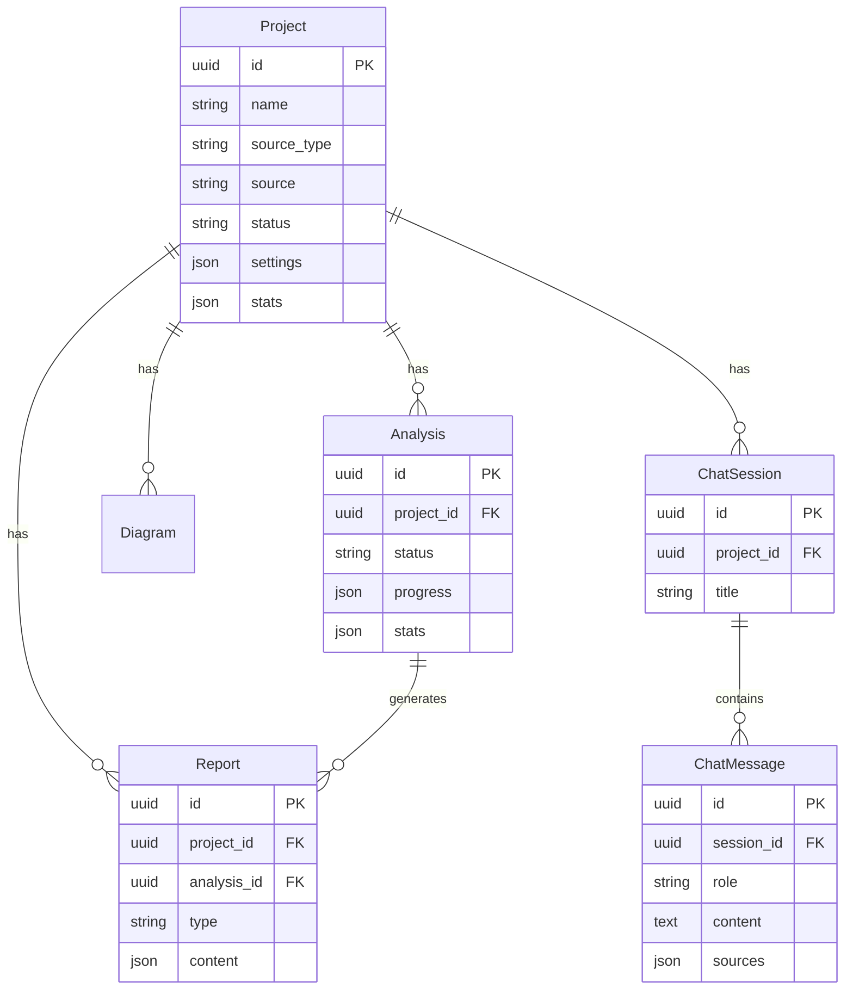

# CodeCompass Backend API - Product Requirements Document

## Document Info
| Field | Value |
|-------|-------|
| **Version** | 1.1 |
| **Status** | Approved |
| **Author** | Product Manager |
| **Last Updated** | 2026-01-19 |
| **Related Documents** | 000-PRD_LANDING_PAGE.md, 004-PRD-TEST_PLAN.md |

---

## 1. Executive Summary

This document specifies the backend API requirements for CodeCompass. The backend serves as the core engine that powers all landing page functionality including project management, code analysis, report generation, vector search, and AI-powered chat.

### Technology Stack
| Component | Technology |
|-----------|------------|
| **Framework** | FastAPI (Python 3.11+) |
| **Database** | SQLite (metadata) + Qdrant (vectors) |
| **ORM** | SQLAlchemy 2.0 |
| **Validation** | Pydantic v2 |
| **Background Tasks** | FastAPI BackgroundTasks |
| **Code Parsing** | Tree-sitter |
| **LLM Provider** | Ollama (default), with provider abstraction |
| **LLM Model** | qwen2.5-coder:7b (configurable) |
| **Embeddings** | sentence-transformers (all-MiniLM-L6-v2) |
| **Streaming** | Server-Sent Events (SSE) |

### Implementation Status
| Feature | Status |
|---------|--------|
| Project CRUD | ✅ Implemented |
| Git Cloning | ✅ Implemented |
| Tree-sitter Analysis | ✅ Implemented |
| Status Polling | ✅ Implemented |
| Vector Search (Qdrant) | ✅ Implemented |
| Embedding Generation | ✅ Implemented |
| RAG Pipeline | ✅ Implemented |
| Streaming Chat (SSE) | ✅ Implemented |
| Report Generation | 🔄 Planned |
| Diagram Generation | 🔄 Planned |

---

## 2. API Endpoints Specification

### 2.1 Health & Status

#### `GET /health`
Health check endpoint for monitoring and container orchestration.

**Response:**
```json
{
  "status": "healthy",
  "version": "0.1.0",
  "uptime_seconds": 3600,
  "llm_provider": "local",
  "llm_status": "ready"
}
```

#### `GET /`
Root endpoint with API information.

**Response:**
```json
{
  "name": "CodeCompass API",
  "version": "0.1.0",
  "docs_url": "/docs"
}
```

---

### 2.2 Projects API

#### `POST /api/projects`
Create a new project from Git URL or local path.

**Supports Frontend:** US-1.1 (Git URL), US-1.2 (Local Folder)

**Request Body:**
```json
{
  "name": "my-project",
  "source_type": "git_url | local_path",
  "source": "https://github.com/user/repo.git | /path/to/folder",
  "branch": "main",
  "description": "Optional description",
  "settings": {
    "ignore_patterns": ["*.log", "node_modules"],
    "analyze_languages": ["python", "javascript", "typescript"]
  }
}
```

**Response (201 Created):**
```json
{
  "id": "uuid-string",
  "name": "my-project",
  "source_type": "git_url",
  "source": "https://github.com/user/repo.git",
  "branch": "main",
  "status": "pending",
  "created_at": "2026-01-10T12:00:00Z",
  "updated_at": "2026-01-10T12:00:00Z"
}
```

**Validation Rules:**
- `name`: Required, 1-100 chars, alphanumeric + hyphens/underscores
- `source_type`: Required, enum ["git_url", "local_path"]
- `source`: Required, valid URL or existing path
- `branch`: Optional, defaults to "main" or "master"

**Error Responses:**
| Code | Condition | Message |
|------|-----------|---------|
| 400 | Invalid URL format | "Invalid git URL format" |
| 400 | Path doesn't exist | "Local path does not exist" |
| 400 | Empty folder | "No source code files found in folder" |
| 409 | Duplicate project | "Project with this source already exists" |

---

#### `GET /api/projects`
List all projects with optional filtering.

**Query Parameters:**
| Param | Type | Description |
|-------|------|-------------|
| `status` | string | Filter by status (pending, analyzing, ready, failed) |
| `search` | string | Search in name/description |
| `sort` | string | Sort field (created_at, updated_at, name) |
| `order` | string | asc or desc (default: desc) |
| `limit` | int | Max results (default: 20, max: 100) |
| `offset` | int | Pagination offset |

**Response:**
```json
{
  "items": [
    {
      "id": "uuid-1",
      "name": "project-1",
      "source_type": "git_url",
      "status": "ready",
      "stats": {
        "files": 150,
        "lines_of_code": 25000,
        "languages": ["python", "javascript"]
      },
      "last_analyzed_at": "2026-01-10T12:00:00Z",
      "created_at": "2026-01-09T10:00:00Z"
    }
  ],
  "total": 5,
  "limit": 20,
  "offset": 0
}
```

---

#### `GET /api/projects/{id}`
Get detailed project information.

**Response:**
```json
{
  "id": "uuid-string",
  "name": "my-project",
  "description": "Project description",
  "source_type": "git_url",
  "source": "https://github.com/user/repo.git",
  "branch": "main",
  "local_path": "/app/repos/uuid-string",
  "status": "ready",
  "settings": {
    "ignore_patterns": ["*.log"],
    "analyze_languages": ["python"]
  },
  "stats": {
    "files": 150,
    "directories": 25,
    "lines_of_code": 25000,
    "languages": {
      "python": {"files": 80, "lines": 15000},
      "javascript": {"files": 70, "lines": 10000}
    },
    "dependencies": {
      "external": 45,
      "internal_modules": 12
    }
  },
  "created_at": "2026-01-09T10:00:00Z",
  "updated_at": "2026-01-10T12:00:00Z",
  "last_analyzed_at": "2026-01-10T12:00:00Z"
}
```

---

#### `PUT /api/projects/{id}`
Update project settings.

**Request Body:**
```json
{
  "name": "new-name",
  "description": "Updated description",
  "settings": {
    "ignore_patterns": ["*.log", "dist/"]
  }
}
```

---

#### `DELETE /api/projects/{id}`
Delete a project and all associated data.

**Supports Frontend:** US-4.2 (Delete Project)

**Query Parameters:**
| Param | Type | Description |
|-------|------|-------------|
| `delete_files` | bool | Also delete cloned repo files (default: true) |

**Response (200 OK):**
```json
{
  "message": "Project deleted successfully",
  "deleted": {
    "project": true,
    "analyses": 3,
    "reports": 4,
    "diagrams": 5,
    "chat_sessions": 2,
    "vector_embeddings": 1500,
    "files": true
  }
}
```

---

### 2.3 Analysis API

#### `POST /api/projects/{id}/analyze`
Trigger code analysis (runs in background).

**Supports Frontend:** US-1.3 (Onboarding Progress)

**Request Body (optional):**
```json
{
  "force": false,
  "options": {
    "generate_reports": true,
    "generate_diagrams": true,
    "build_embeddings": true
  }
}
```

**Response (202 Accepted):**
```json
{
  "analysis_id": "uuid-string",
  "status": "queued",
  "message": "Analysis started",
  "estimated_duration_seconds": 120
}
```

---

#### `GET /api/projects/{id}/analysis`
Get current/latest analysis status.

**Supports Frontend:** US-1.3 (Progress Indicator)

**Response:**
```json
{
  "id": "uuid-string",
  "project_id": "project-uuid",
  "status": "running",
  "progress": {
    "current_step": "analyzing",
    "steps": [
      {"name": "cloning", "status": "completed", "duration_ms": 5000},
      {"name": "scanning", "status": "completed", "duration_ms": 2000, "details": {"files_found": 150}},
      {"name": "analyzing", "status": "running", "progress_percent": 67, "details": {"current_file": "src/services/auth.ts", "files_processed": 100, "files_total": 150}},
      {"name": "generating_reports", "status": "pending"},
      {"name": "building_index", "status": "pending"}
    ],
    "overall_percent": 45,
    "estimated_remaining_seconds": 90
  },
  "started_at": "2026-01-10T12:00:00Z",
  "completed_at": null
}
```

**Status Values:**
| Status | Description |
|--------|-------------|
| `queued` | Waiting to start |
| `running` | Currently processing |
| `completed` | Successfully finished |
| `failed` | Error occurred |
| `cancelled` | User cancelled |

---

#### `DELETE /api/projects/{id}/analysis`
Cancel ongoing analysis.

**Response:**
```json
{
  "message": "Analysis cancelled",
  "analysis_id": "uuid-string"
}
```

---

### 2.4 Reports API

#### `GET /api/projects/{id}/reports`
List all generated reports for a project.

**Supports Frontend:** US-3.1 (Architecture Report)

**Response:**
```json
{
  "items": [
    {
      "id": "uuid-1",
      "type": "summary",
      "title": "Project Summary",
      "generated_at": "2026-01-10T12:00:00Z"
    },
    {
      "id": "uuid-2",
      "type": "architecture",
      "title": "Architecture Overview",
      "generated_at": "2026-01-10T12:00:00Z"
    },
    {
      "id": "uuid-3",
      "type": "dependencies",
      "title": "Dependency Analysis",
      "generated_at": "2026-01-10T12:00:00Z"
    }
  ]
}
```

---

#### `GET /api/projects/{id}/reports/{type}`
Get specific report content.

**Report Types:** `summary`, `architecture`, `developer`, `dependencies`

**Response:**
```json
{
  "id": "uuid-string",
  "type": "architecture",
  "title": "Architecture Overview",
  "content": {
    "format": "markdown",
    "body": "# Architecture Overview\n\n## Tech Stack\n...",
    "sections": [
      {
        "id": "tech-stack",
        "title": "Technology Stack",
        "content": "..."
      },
      {
        "id": "architecture-pattern",
        "title": "Architecture Pattern",
        "content": "This project follows a **layered architecture**..."
      }
    ]
  },
  "metadata": {
    "languages": ["python", "typescript"],
    "frameworks": ["fastapi", "react"],
    "patterns_detected": ["mvc", "repository"]
  },
  "generated_at": "2026-01-10T12:00:00Z"
}
```

---

### 2.5 Diagrams API

#### `GET /api/projects/{id}/diagrams`
List available diagrams.

**Supports Frontend:** US-3.2 (Architecture Diagrams)

**Response:**
```json
{
  "items": [
    {
      "id": "uuid-1",
      "type": "architecture",
      "title": "System Architecture",
      "preview_available": true
    },
    {
      "id": "uuid-2",
      "type": "dependency",
      "title": "Module Dependencies",
      "preview_available": true
    },
    {
      "id": "uuid-3",
      "type": "directory",
      "title": "Directory Structure",
      "preview_available": true
    }
  ]
}
```

---

#### `GET /api/projects/{id}/diagrams/{type}`
Get specific diagram Mermaid code.

**Diagram Types:** `architecture`, `dependency`, `directory`, `class`, `sequence`

**Response:**
```json
{
  "id": "uuid-string",
  "type": "dependency",
  "title": "Module Dependencies",
  "mermaid_code": "graph TD\n    A[app] --> B[services]\n    B --> C[models]\n    ...",
  "metadata": {
    "nodes": 15,
    "edges": 23,
    "max_depth": 4
  },
  "generated_at": "2026-01-10T12:00:00Z"
}
```

---

#### `GET /api/projects/{id}/diagrams/{type}/svg`
Get pre-rendered SVG (for export).

**Response:** SVG image (Content-Type: image/svg+xml)

---

### 2.6 Files API

#### `GET /api/projects/{id}/files`
Get file tree structure.

**Supports Frontend:** US-3.3 (Explore File Tree)

**Query Parameters:**
| Param | Type | Description |
|-------|------|-------------|
| `depth` | int | Max depth to return (default: unlimited) |
| `include_hidden` | bool | Include hidden files (default: false) |

**Response:**
```json
{
  "root": {
    "name": "my-project",
    "type": "directory",
    "children": [
      {
        "name": "src",
        "type": "directory",
        "children": [
          {
            "name": "main.py",
            "type": "file",
            "language": "python",
            "size_bytes": 2500,
            "lines": 85
          }
        ]
      },
      {
        "name": "README.md",
        "type": "file",
        "language": "markdown",
        "size_bytes": 1200,
        "lines": 45
      }
    ]
  },
  "stats": {
    "total_files": 150,
    "total_directories": 25
  }
}
```

---

#### `GET /api/projects/{id}/files/{path:path}`
Get file content with syntax highlighting hints.

**Response:**
```json
{
  "path": "src/services/auth.ts",
  "name": "auth.ts",
  "language": "typescript",
  "content": "import { User } from '../models';\n\nexport class AuthService {\n  ...",
  "lines": 150,
  "size_bytes": 4500,
  "encoding": "utf-8",
  "last_modified": "2026-01-09T15:30:00Z"
}
```

---

### 2.7 Search API

#### `POST /api/projects/{id}/search`
Semantic code search using vector embeddings.

**Request Body:**
```json
{
  "query": "how does authentication work",
  "limit": 10,
  "filters": {
    "languages": ["python", "typescript"],
    "file_patterns": ["src/**/*.py"],
    "chunk_types": ["function", "class"]
  }
}
```

**Response:**
```json
{
  "query": "how does authentication work",
  "results": [
    {
      "score": 0.92,
      "file_path": "src/services/auth.ts",
      "chunk_type": "class",
      "name": "AuthService",
      "start_line": 15,
      "end_line": 85,
      "content": "export class AuthService {\n  async login(credentials: Credentials) {\n    ...",
      "language": "typescript",
      "context": {
        "module": "services",
        "imports": ["models.User", "utils.jwt"]
      }
    }
  ],
  "total_results": 8,
  "search_time_ms": 45
}
```

---

### 2.8 Chat API

#### `POST /api/projects/{id}/chat`
Send a chat message and get AI response.

**Supports Frontend:** US-2.1 (Ask Questions), US-2.2 (Code Suggestions), US-2.3 (Context Awareness)

**Request Body:**
```json
{
  "message": "How does the authentication flow work?",
  "session_id": "uuid-string-or-null-for-new",
  "options": {
    "include_sources": true,
    "max_context_chunks": 5,
    "stream": false
  }
}
```

**Response (non-streaming):**
```json
{
  "session_id": "uuid-string",
  "message_id": "uuid-string",
  "response": {
    "content": "The authentication flow in this codebase works as follows:\n\n1. **Login Request**...",
    "format": "markdown",
    "sources": [
      {
        "file_path": "src/services/auth.ts",
        "start_line": 15,
        "end_line": 45,
        "snippet": "export class AuthService {\n  async login...",
        "relevance_score": 0.95
      }
    ],
    "tokens_used": {
      "prompt": 1500,
      "completion": 350
    }
  },
  "created_at": "2026-01-10T12:00:00Z"
}
```

**Streaming Response (when `stream: true`):**
Server-Sent Events (SSE) with chunks:
```
event: start
data: {"session_id": "uuid", "message_id": "uuid"}

event: chunk
data: {"content": "The authentication"}

event: chunk
data: {"content": " flow in this"}

event: sources
data: {"sources": [...]}

event: done
data: {"tokens_used": {...}}
```

---

#### `GET /api/projects/{id}/chat/sessions`
List chat sessions.

**Response:**
```json
{
  "items": [
    {
      "id": "uuid-1",
      "title": "Authentication Discussion",
      "message_count": 12,
      "created_at": "2026-01-10T10:00:00Z",
      "last_message_at": "2026-01-10T12:00:00Z"
    }
  ]
}
```

---

#### `GET /api/projects/{id}/chat/sessions/{session_id}`
Get chat session history.

**Response:**
```json
{
  "id": "uuid-string",
  "title": "Authentication Discussion",
  "messages": [
    {
      "id": "msg-1",
      "role": "user",
      "content": "How does auth work?",
      "created_at": "2026-01-10T10:00:00Z"
    },
    {
      "id": "msg-2",
      "role": "assistant",
      "content": "The authentication...",
      "sources": [...],
      "created_at": "2026-01-10T10:00:05Z"
    }
  ],
  "created_at": "2026-01-10T10:00:00Z"
}
```

---

#### `DELETE /api/projects/{id}/chat/sessions/{session_id}`
Delete a chat session.

---

### 2.9 Settings API

#### `GET /api/settings`
Get current application settings.

**Response:**
```json
{
  "llm": {
    "provider": "local",
    "model": "microsoft/Phi-3.5-mini-instruct",
    "status": "ready",
    "capabilities": {
      "max_context_length": 4096,
      "supports_streaming": true
    }
  },
  "embedding": {
    "model": "sentence-transformers/all-MiniLM-L6-v2",
    "dimensions": 384,
    "status": "ready"
  },
  "analysis": {
    "supported_languages": ["python", "javascript", "typescript"],
    "max_file_size_mb": 10,
    "max_repo_size_mb": 1000
  }
}
```

---

#### `PUT /api/settings`
Update settings.

**Request Body:**
```json
{
  "llm": {
    "provider": "ollama",
    "model": "llama3.2",
    "base_url": "http://localhost:11434"
  }
}
```

---

#### `GET /api/settings/providers`
List available LLM providers.

**Response:**
```json
{
  "providers": [
    {
      "id": "local",
      "name": "Local (HuggingFace)",
      "status": "ready",
      "models": ["microsoft/Phi-3.5-mini-instruct"]
    },
    {
      "id": "ollama",
      "name": "Ollama",
      "status": "available",
      "models": []
    },
    {
      "id": "lmstudio",
      "name": "LM Studio",
      "status": "unavailable",
      "models": []
    }
  ]
}
```

---

#### `POST /api/settings/test`
Test LLM connection.

**Request Body:**
```json
{
  "provider": "ollama",
  "model": "llama3.2",
  "base_url": "http://localhost:11434"
}
```

**Response:**
```json
{
  "success": true,
  "response_time_ms": 1500,
  "model_info": {
    "name": "llama3.2",
    "parameters": "3B",
    "context_length": 8192
  }
}
```

---

## 3. Services Architecture

### 3.1 Service Dependency Graph

```
┌─────────────────────────────────────────────────────────────────┐
│                          API Layer                               │
│  projects.py  analysis.py  reports.py  chat.py  settings.py     │
└─────────────────────────────────────────────────────────────────┘
                              │
                              ▼
┌─────────────────────────────────────────────────────────────────┐
│                       Service Layer                              │
├─────────────┬─────────────┬─────────────┬─────────────┬────────┤
│ GitService  │AnalyzerSvc  │ ReportSvc   │ ChatService │VectorSvc│
│             │             │             │             │         │
│ - clone()   │ - analyze() │ - generate()│ - chat()    │-search()│
│ - pull()    │ - scan()    │ - format()  │ - stream()  │-index() │
│ - validate()│ - parse()   │             │             │-delete()│
└─────────────┴─────────────┴─────────────┴─────────────┴────────┘
                              │
                              ▼
┌─────────────────────────────────────────────────────────────────┐
│                     LLM Provider Layer                           │
├───────────────┬───────────────┬───────────────┬────────────────┤
│ LocalProvider │ OllamaProvider│LMStudioProvider│ CloudProvider  │
│               │               │               │                │
│ HuggingFace   │ HTTP Client   │ HTTP Client   │ OpenAI/Claude  │
│ Transformers  │ localhost:11434│localhost:1234│ API Clients    │
└───────────────┴───────────────┴───────────────┴────────────────┘
                              │
                              ▼
┌─────────────────────────────────────────────────────────────────┐
│                       Data Layer                                 │
├─────────────────────────────┬───────────────────────────────────┤
│         SQLite              │            Qdrant                  │
│                             │                                    │
│ - Projects                  │ - Code Embeddings                  │
│ - Analyses                  │ - Metadata                         │
│ - Reports                   │                                    │
│ - ChatSessions              │                                    │
│ - ChatMessages              │                                    │
└─────────────────────────────┴───────────────────────────────────┘
```

### 3.2 Service Responsibilities

#### GitService
| Method | Description |
|--------|-------------|
| `clone(url, branch)` | Clone git repository to local storage |
| `pull(project_id)` | Update existing clone |
| `validate_url(url)` | Validate git URL format and accessibility |
| `validate_path(path)` | Validate local path exists and contains code |
| `get_file_tree(path)` | Generate file tree structure |
| `read_file(path)` | Read file content with encoding detection |

#### AnalyzerService
| Method | Description |
|--------|-------------|
| `analyze(project_id)` | Full analysis pipeline |
| `scan_files(path)` | Discover all code files |
| `detect_languages(files)` | Identify programming languages |
| `parse_file(path, language)` | Parse with Tree-sitter |
| `extract_dependencies(parsed)` | Find imports/exports |
| `calculate_metrics(parsed)` | LOC, complexity, etc. |

#### ReportGeneratorService
| Method | Description |
|--------|-------------|
| `generate_all(analysis)` | Generate all report types |
| `generate_summary(analysis)` | Executive summary |
| `generate_architecture(analysis)` | Architecture report |
| `generate_dependencies(analysis)` | Dependency analysis |

#### DiagramGeneratorService
| Method | Description |
|--------|-------------|
| `generate_all(analysis)` | Generate all diagram types |
| `generate_architecture_diagram(analysis)` | System architecture |
| `generate_dependency_graph(analysis)` | Module dependencies |
| `generate_directory_tree(analysis)` | File structure |
| `render_to_svg(mermaid_code)` | Pre-render diagram |

#### ChatService
| Method | Description |
|--------|-------------|
| `chat(project_id, message, session_id)` | Process chat message |
| `stream_chat(...)` | Streaming response via SSE |
| `get_context(query, project_id)` | RAG context retrieval |
| `format_prompt(query, context)` | Build LLM prompt |

#### RAGService ✅ Implemented
| Method | Description |
|--------|-------------|
| `query(project_id, question)` | Full RAG pipeline: retrieve + generate |
| `query_stream(project_id, question)` | Streaming RAG with SSE |
| `_retrieve_context(project_id, question)` | Vector search for relevant chunks |
| `_build_prompt(question, context)` | Format prompt with retrieved context |
| `_generate_response(prompt)` | LLM generation |

#### ChunkingService ✅ Implemented
| Method | Description |
|--------|-------------|
| `chunk_file(file_path, content, language)` | Split file into semantic chunks |
| `chunk_function(node, content)` | Extract function-level chunks |
| `chunk_class(node, content)` | Extract class-level chunks |
| `get_chunk_metadata(chunk)` | Extract metadata (imports, docstrings) |

#### VectorService ✅ Implemented
| Method | Description |
|--------|-------------|
| `index_project(project_id, chunks)` | Create embeddings and store in Qdrant |
| `search(project_id, query, limit)` | Semantic search with filters |
| `delete_project(project_id)` | Remove all project embeddings |
| `get_collection_info(project_id)` | Get vector count and metadata |

#### EmbeddingProvider ✅ Implemented
| Method | Description |
|--------|-------------|
| `embed(text)` | Generate single embedding vector |
| `embed_batch(texts)` | Batch embedding for efficiency |
| `get_dimensions()` | Get embedding dimensions (384) |
| `health_check()` | Verify embedding service is running |

---

## 4. Data Models (SQLAlchemy)

### 4.1 Project Model
```python
class Project(Base):
    __tablename__ = "projects"

    id: Mapped[UUID] = mapped_column(primary_key=True, default=uuid4)
    name: Mapped[str] = mapped_column(String(100), nullable=False)
    description: Mapped[Optional[str]] = mapped_column(Text)
    source_type: Mapped[str] = mapped_column(String(20))  # git_url, local_path
    source: Mapped[str] = mapped_column(String(500))
    branch: Mapped[str] = mapped_column(String(100), default="main")
    local_path: Mapped[Optional[str]] = mapped_column(String(500))
    status: Mapped[str] = mapped_column(String(20), default="pending")
    settings: Mapped[dict] = mapped_column(JSON, default=dict)
    stats: Mapped[Optional[dict]] = mapped_column(JSON)
    created_at: Mapped[datetime] = mapped_column(default=datetime.utcnow)
    updated_at: Mapped[datetime] = mapped_column(onupdate=datetime.utcnow)
    last_analyzed_at: Mapped[Optional[datetime]] = mapped_column()

    # Relationships
    analyses: Mapped[List["Analysis"]] = relationship(back_populates="project")
    reports: Mapped[List["Report"]] = relationship(back_populates="project")
    diagrams: Mapped[List["Diagram"]] = relationship(back_populates="project")
    chat_sessions: Mapped[List["ChatSession"]] = relationship(back_populates="project")
```

### 4.2 Analysis Model
```python
class Analysis(Base):
    __tablename__ = "analyses"

    id: Mapped[UUID] = mapped_column(primary_key=True, default=uuid4)
    project_id: Mapped[UUID] = mapped_column(ForeignKey("projects.id"))
    status: Mapped[str] = mapped_column(String(20), default="queued")
    progress: Mapped[dict] = mapped_column(JSON, default=dict)
    stats: Mapped[Optional[dict]] = mapped_column(JSON)
    error: Mapped[Optional[str]] = mapped_column(Text)
    started_at: Mapped[Optional[datetime]] = mapped_column()
    completed_at: Mapped[Optional[datetime]] = mapped_column()
    created_at: Mapped[datetime] = mapped_column(default=datetime.utcnow)

    # Relationships
    project: Mapped["Project"] = relationship(back_populates="analyses")
    reports: Mapped[List["Report"]] = relationship(back_populates="analysis")
```

### 4.3 Report Model
```python
class Report(Base):
    __tablename__ = "reports"

    id: Mapped[UUID] = mapped_column(primary_key=True, default=uuid4)
    project_id: Mapped[UUID] = mapped_column(ForeignKey("projects.id"))
    analysis_id: Mapped[UUID] = mapped_column(ForeignKey("analyses.id"))
    type: Mapped[str] = mapped_column(String(50))  # summary, architecture, etc.
    title: Mapped[str] = mapped_column(String(200))
    content: Mapped[dict] = mapped_column(JSON)
    metadata: Mapped[Optional[dict]] = mapped_column(JSON)
    created_at: Mapped[datetime] = mapped_column(default=datetime.utcnow)

    # Relationships
    project: Mapped["Project"] = relationship(back_populates="reports")
    analysis: Mapped["Analysis"] = relationship(back_populates="reports")
```

### 4.4 Diagram Model
```python
class Diagram(Base):
    __tablename__ = "diagrams"

    id: Mapped[UUID] = mapped_column(primary_key=True, default=uuid4)
    project_id: Mapped[UUID] = mapped_column(ForeignKey("projects.id"))
    type: Mapped[str] = mapped_column(String(50))
    title: Mapped[str] = mapped_column(String(200))
    mermaid_code: Mapped[str] = mapped_column(Text)
    metadata: Mapped[Optional[dict]] = mapped_column(JSON)
    created_at: Mapped[datetime] = mapped_column(default=datetime.utcnow)

    # Relationships
    project: Mapped["Project"] = relationship(back_populates="diagrams")
```

### 4.5 ChatSession & ChatMessage Models
```python
class ChatSession(Base):
    __tablename__ = "chat_sessions"

    id: Mapped[UUID] = mapped_column(primary_key=True, default=uuid4)
    project_id: Mapped[UUID] = mapped_column(ForeignKey("projects.id"))
    title: Mapped[Optional[str]] = mapped_column(String(200))
    created_at: Mapped[datetime] = mapped_column(default=datetime.utcnow)
    updated_at: Mapped[datetime] = mapped_column(onupdate=datetime.utcnow)

    # Relationships
    project: Mapped["Project"] = relationship(back_populates="chat_sessions")
    messages: Mapped[List["ChatMessage"]] = relationship(back_populates="session")


class ChatMessage(Base):
    __tablename__ = "chat_messages"

    id: Mapped[UUID] = mapped_column(primary_key=True, default=uuid4)
    session_id: Mapped[UUID] = mapped_column(ForeignKey("chat_sessions.id"))
    role: Mapped[str] = mapped_column(String(20))  # user, assistant
    content: Mapped[str] = mapped_column(Text)
    sources: Mapped[Optional[dict]] = mapped_column(JSON)
    tokens_used: Mapped[Optional[dict]] = mapped_column(JSON)
    created_at: Mapped[datetime] = mapped_column(default=datetime.utcnow)

    # Relationships
    session: Mapped["ChatSession"] = relationship(back_populates="messages")
```

---

## 5. Background Tasks

### 5.1 Analysis Pipeline
```
┌─────────────────────────────────────────────────────────────────┐
│                    Analysis Background Task                      │
├─────────────────────────────────────────────────────────────────┤
│                                                                  │
│  1. CLONE (if git_url)                                          │
│     └─► GitService.clone()                                      │
│     └─► Update progress: {"step": "cloning", "percent": 100}    │
│                                                                  │
│  2. SCAN                                                         │
│     └─► AnalyzerService.scan_files()                            │
│     └─► Update progress: {"step": "scanning", "files": 150}     │
│                                                                  │
│  3. ANALYZE                                                      │
│     └─► For each file:                                          │
│         └─► AnalyzerService.parse_file()                        │
│         └─► Update progress: {"step": "analyzing", "percent": X}│
│                                                                  │
│  4. GENERATE REPORTS                                             │
│     └─► ReportGeneratorService.generate_all()                   │
│     └─► DiagramGeneratorService.generate_all()                  │
│     └─► Update progress: {"step": "generating_reports"}         │
│                                                                  │
│  5. BUILD INDEX                                                  │
│     └─► VectorService.index_project()                           │
│     └─► Update progress: {"step": "building_index", "percent": X}│
│                                                                  │
│  6. COMPLETE                                                     │
│     └─► Update project.status = "ready"                         │
│     └─► Update analysis.status = "completed"                    │
│                                                                  │
└─────────────────────────────────────────────────────────────────┘
```

### 5.2 Progress Tracking
Progress is stored in the `Analysis.progress` JSON field and can be polled by the frontend.

```python
# Progress structure
{
    "current_step": "analyzing",
    "steps": {
        "cloning": {"status": "completed", "duration_ms": 5000},
        "scanning": {"status": "completed", "files_found": 150},
        "analyzing": {
            "status": "running",
            "progress_percent": 67,
            "files_processed": 100,
            "files_total": 150,
            "current_file": "src/services/auth.ts"
        },
        "generating_reports": {"status": "pending"},
        "building_index": {"status": "pending"}
    },
    "overall_percent": 45,
    "estimated_remaining_seconds": 90
}
```

---

## 6. LLM Provider System

### 6.1 Provider Interface
```python
class LLMProvider(ABC):
    """Abstract base class for LLM providers."""

    @abstractmethod
    async def generate(
        self,
        prompt: str,
        max_tokens: int = 1000,
        temperature: float = 0.7,
        stream: bool = False
    ) -> Union[str, AsyncGenerator[str, None]]:
        """Generate text completion."""
        pass

    @abstractmethod
    async def embed(self, text: str) -> List[float]:
        """Generate embedding vector."""
        pass

    @abstractmethod
    def get_model_info(self) -> dict:
        """Get model capabilities and info."""
        pass

    @abstractmethod
    async def health_check(self) -> bool:
        """Check if provider is available."""
        pass
```

### 6.2 Provider Implementations

| Provider | Status | Configuration |
|----------|--------|---------------|
| `OllamaProvider` | ✅ Implemented | Base URL, model name |
| `LocalProvider` | 🔄 Planned | HuggingFace model path |
| `LMStudioProvider` | 🔄 Planned | Base URL, model name |
| `OpenAIProvider` | 🔄 Planned | API key, model name |
| `AnthropicProvider` | 🔄 Planned | API key, model name |

**Current Default Configuration:**
```python
OLLAMA_BASE_URL = "http://localhost:11434"
OLLAMA_MODEL = "qwen2.5-coder:7b"
```

### 6.3 Provider Factory
```python
class LLMProviderFactory:
    @staticmethod
    def create(config: LLMConfig) -> LLMProvider:
        match config.provider:
            case "local":
                return LocalProvider(config.model_name)
            case "ollama":
                return OllamaProvider(config.base_url, config.model_name)
            case "lmstudio":
                return LMStudioProvider(config.base_url, config.model_name)
            case "openai":
                return OpenAIProvider(config.api_key, config.model_name)
            case "anthropic":
                return AnthropicProvider(config.api_key, config.model_name)
            case _:
                raise ValueError(f"Unknown provider: {config.provider}")
```

---

## 7. Error Handling

### 7.1 Error Response Format
```json
{
  "error": {
    "code": "PROJECT_NOT_FOUND",
    "message": "Project with ID 'xyz' not found",
    "details": {
      "project_id": "xyz"
    }
  },
  "request_id": "uuid-string",
  "timestamp": "2026-01-10T12:00:00Z"
}
```

### 7.2 Error Codes
| Code | HTTP Status | Description |
|------|-------------|-------------|
| `VALIDATION_ERROR` | 400 | Request validation failed |
| `INVALID_GIT_URL` | 400 | Git URL format invalid |
| `PATH_NOT_FOUND` | 400 | Local path doesn't exist |
| `PROJECT_NOT_FOUND` | 404 | Project ID not found |
| `ANALYSIS_NOT_FOUND` | 404 | Analysis ID not found |
| `REPORT_NOT_FOUND` | 404 | Report type not found |
| `DUPLICATE_PROJECT` | 409 | Project with source exists |
| `ANALYSIS_IN_PROGRESS` | 409 | Analysis already running |
| `LLM_UNAVAILABLE` | 503 | LLM provider not responding |
| `EMBEDDING_ERROR` | 500 | Failed to generate embeddings |
| `GIT_CLONE_FAILED` | 500 | Git clone operation failed |

### 7.3 Exception Classes
```python
class CodeCompassError(Exception):
    """Base exception for all CodeCompass errors."""
    code: str
    status_code: int

class ProjectNotFoundError(CodeCompassError):
    code = "PROJECT_NOT_FOUND"
    status_code = 404

class AnalysisInProgressError(CodeCompassError):
    code = "ANALYSIS_IN_PROGRESS"
    status_code = 409

class LLMUnavailableError(CodeCompassError):
    code = "LLM_UNAVAILABLE"
    status_code = 503
```

---

## 8. Security & Validation

### 8.1 Input Validation
| Field | Validation |
|-------|------------|
| `project.name` | 1-100 chars, alphanumeric + `-_` |
| `project.source` (URL) | Valid git URL pattern |
| `project.source` (path) | Existing directory, readable |
| `chat.message` | Max 10,000 chars |
| `search.query` | Max 500 chars |
| `search.limit` | 1-100 |

### 8.2 Path Traversal Prevention
```python
def validate_file_path(project_path: str, requested_path: str) -> str:
    """Ensure requested path is within project directory."""
    base = Path(project_path).resolve()
    requested = (base / requested_path).resolve()

    if not requested.is_relative_to(base):
        raise SecurityError("Path traversal detected")

    return str(requested)
```

### 8.3 Rate Limiting (Future)
| Endpoint | Limit |
|----------|-------|
| `POST /api/projects` | 10/minute |
| `POST /api/projects/{id}/analyze` | 5/minute |
| `POST /api/projects/{id}/chat` | 30/minute |
| `POST /api/projects/{id}/search` | 60/minute |

---

## 9. Performance Requirements

### 9.1 Response Time Targets
| Endpoint | Target (p95) |
|----------|-------------|
| `GET /api/projects` | < 100ms |
| `GET /api/projects/{id}` | < 50ms |
| `GET /api/projects/{id}/files` | < 500ms |
| `GET /api/projects/{id}/files/{path}` | < 100ms |
| `POST /api/projects/{id}/search` | < 2s |
| `POST /api/projects/{id}/chat` (first token) | < 500ms |
| `GET /api/projects/{id}/analysis` | < 50ms |

### 9.2 Throughput
| Metric | Target |
|--------|--------|
| Concurrent requests | 100 |
| Projects per instance | 1000 |
| Max files per project | 100,000 |
| Max repo size | 1GB |

### 9.3 Resource Limits
| Resource | Limit |
|----------|-------|
| Max file size for content API | 10MB |
| Max embedding batch size | 100 |
| Max chat context tokens | 4096 |
| Background task timeout | 30 minutes |

---

## 10. Testing Strategy

### 10.1 Unit Tests
```
tests/
├── unit/
│   ├── test_git_service.py
│   ├── test_analyzer_service.py
│   ├── test_report_generator.py
│   ├── test_chat_service.py
│   ├── test_vector_service.py
│   └── test_llm_providers.py
```

**Coverage Target:** 80%+

### 10.2 Integration Tests
```
tests/
├── integration/
│   ├── test_projects_api.py
│   ├── test_analysis_api.py
│   ├── test_chat_api.py
│   └── test_full_pipeline.py
```

### 10.3 Test Fixtures
| Fixture | Description |
|---------|-------------|
| `small_python_project` | 10 files, pure Python |
| `medium_mixed_project` | 100 files, Python + JS |
| `large_monorepo` | 1000 files, multiple languages |

### 10.4 Mock Providers
```python
class MockLLMProvider(LLMProvider):
    """Mock provider for testing without real LLM."""

    async def generate(self, prompt: str, **kwargs) -> str:
        return f"Mock response for: {prompt[:50]}..."

    async def embed(self, text: str) -> List[float]:
        return [0.1] * 384  # Mock embedding
```

---

## 11. Mapping to Frontend PRD

| Frontend User Story | Backend Endpoints |
|---------------------|-------------------|
| US-1.1 (Git URL) | `POST /api/projects` |
| US-1.2 (Local Folder) | `POST /api/projects` |
| US-1.3 (Progress) | `GET /api/projects/{id}/analysis` |
| US-2.1 (Chat) | `POST /api/projects/{id}/chat` |
| US-2.2 (Suggestions) | `POST /api/projects/{id}/chat` |
| US-2.3 (Context) | `GET /api/projects/{id}/chat/sessions/{id}` |
| US-3.1 (Reports) | `GET /api/projects/{id}/reports/{type}` |
| US-3.2 (Diagrams) | `GET /api/projects/{id}/diagrams/{type}` |
| US-3.3 (File Tree) | `GET /api/projects/{id}/files` |
| US-4.1 (Switch) | `GET /api/projects` |
| US-4.2 (Delete) | `DELETE /api/projects/{id}` |

---

## 12. Open Questions

1. ~~**WebSocket vs SSE for streaming:** SSE is simpler, WebSocket allows bidirectional - which is preferred?~~
   - **RESOLVED:** SSE implemented for streaming chat responses
2. **Analysis cancellation:** Should we support cancelling mid-analysis? (adds complexity)
3. ~~**Embedding storage:** Store in SQLite or only in Qdrant? (redundancy vs simplicity)~~
   - **RESOLVED:** Qdrant only for embeddings, metadata in SQLite
4. **File watching:** Should we detect file changes for automatic re-analysis? (Phase 2?)

---

## 13. Appendix

### A. Example curl Commands
```bash
# Create project
curl -X POST http://localhost:8000/api/projects \
  -H "Content-Type: application/json" \
  -d '{"name": "my-project", "source_type": "git_url", "source": "https://github.com/user/repo.git"}'

# Get analysis status
curl http://localhost:8000/api/projects/{id}/analysis

# Chat
curl -X POST http://localhost:8000/api/projects/{id}/chat \
  -H "Content-Type: application/json" \
  -d '{"message": "How does auth work?"}'

# Search
curl -X POST http://localhost:8000/api/projects/{id}/search \
  -H "Content-Type: application/json" \
  -d '{"query": "authentication"}'
```

### B. Database Schema Diagram

