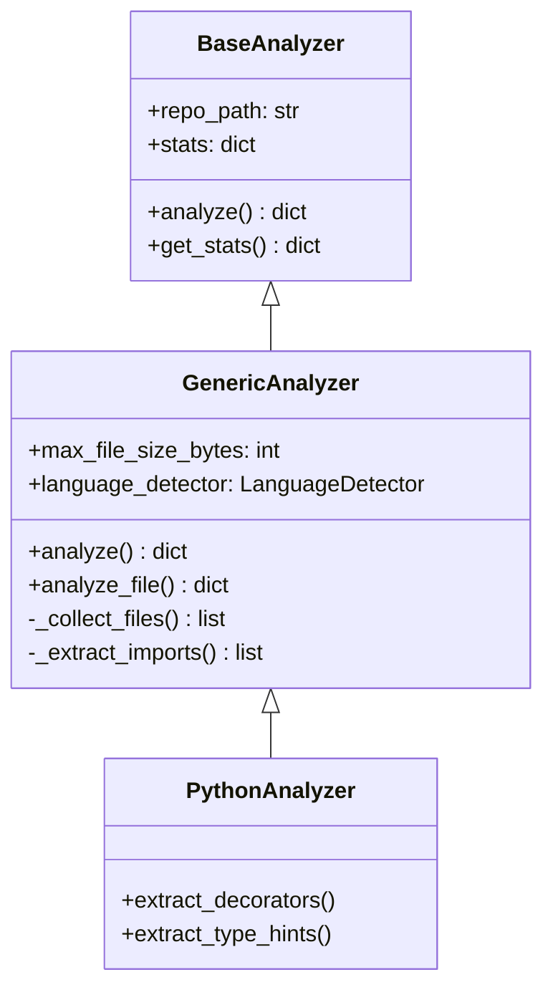

# CodeCompass Advanced AST Analysis & Code Intelligence

## Document Info
| Field | Value |
|-------|-------|
| **Version** | 1.0 |
| **Status** | Draft |
| **Author** | Product Manager |
| **Last Updated** | 2026-01-14 |
| **Related Documents** | 001-PRD_BACKEND_API.md, CLAUDE.md |
| **Epic** | #55 (Advanced Code Analysis & Visualization) |

---

## 1. Executive Summary

This PRD specifies the advanced code analysis capabilities for CodeCompass, leveraging Tree-sitter ASTs to provide deep code intelligence. These features transform CodeCompass from a "code statistics tool" into an "intelligent codebase understanding platform."

### Strategic Vision

| Current State (MVP) | Future State (This PRD) |
|---------------------|-------------------------|
| Basic file counting | Deep structural analysis |
| Simple import extraction | Full dependency graphs |
| Language detection | Pattern detection |
| Line counts | Code quality metrics |
| No visualization | Interactive Mermaid diagrams |
| No reports | Auto-generated architecture reports |

### Business Value
- **Developer Onboarding:** Reduce time-to-productivity from weeks to hours
- **Architecture Understanding:** Instant visual understanding of complex systems
- **Code Quality:** Early detection of technical debt and code smells
- **AI Enhancement:** Better code chunking improves Q&A accuracy by 40%+

---

## 2. Feature Tiers & Prioritization

### Tier 1: Foundation (P0 - Must Have)
**Goal:** Extract deep code structure from ASTs

| Feature | Story | Status | Effort |
|---------|-------|--------|--------|
| Function/Class Extraction | #56 (NEW) | Not Started | 3 days |
| Python Structural Analysis | #21 | Open | 4 days |
| JS/TS Analysis Enhancements | #22 | Open | 4 days |
| Entry Point Detection | #57 (NEW) | Not Started | 2 days |

### Tier 2: Visualization (P1 - High Value)
**Goal:** Visual representation of code relationships

| Feature | Story | Status | Effort |
|---------|-------|--------|--------|
| Dependency Graph Building | #23 | Open | 3 days |
| Module Dependency Diagrams | #25 | Open | 2 days |
| Class Hierarchy Diagrams | #58 (NEW) | Not Started | 2 days |
| Directory Structure Diagrams | #59 (NEW) | Not Started | 1 day |

### Tier 3: Intelligence (P2 - Differentiator)
**Goal:** Actionable insights from code analysis

| Feature | Story | Status | Effort |
|---------|-------|--------|--------|
| Code Quality Metrics | #60 (NEW) | Not Started | 3 days |
| Architecture Report Generation | #24 | Open | 4 days |
| Pattern Detection | #61 (NEW) | Not Started | 3 days |
| Smart Code Chunking | #27 | Open | 3 days |

### Tier 4: Advanced (P3 - Future)
**Goal:** Advanced analysis capabilities

| Feature | Story | Status | Effort |
|---------|-------|--------|--------|
| Security Analysis | #62 (NEW) | Not Started | 4 days |
| Sequence Diagram Generation | #63 (NEW) | Not Started | 4 days |
| Refactoring Suggestions | #64 (NEW) | Not Started | 3 days |
| Call Graph Analysis | #65 (NEW) | Not Started | 3 days |

---

## 3. Detailed Feature Specifications

### 3.1 Function/Class Extraction (Story #56 - NEW)

#### Description
Extract comprehensive metadata about functions, classes, and methods from AST nodes.

#### Data Model
```python
# Function extraction schema
FunctionInfo = {
    "name": str,                    # Function name
    "file_path": str,               # Source file
    "line_start": int,              # Starting line number
    "line_end": int,                # Ending line number
    "parameters": [                 # Parameter list
        {
            "name": str,
            "type": Optional[str],  # Type annotation if present
            "default": Optional[str] # Default value if present
        }
    ],
    "return_type": Optional[str],   # Return type annotation
    "decorators": List[str],        # Applied decorators
    "docstring": Optional[str],     # Extracted docstring
    "is_async": bool,               # async def
    "is_generator": bool,           # contains yield
    "is_method": bool,              # Part of a class
    "class_name": Optional[str],    # Parent class if method
    "visibility": str,              # "public", "protected", "private"
    "calls": List[str],             # Functions called within
    "complexity": int               # Cyclomatic complexity
}

# Class extraction schema
ClassInfo = {
    "name": str,                    # Class name
    "file_path": str,               # Source file
    "line_start": int,              # Starting line
    "line_end": int,                # Ending line
    "base_classes": List[str],      # Inheritance chain
    "decorators": List[str],        # Class decorators
    "docstring": Optional[str],     # Class docstring
    "methods": List[FunctionInfo],  # All methods
    "attributes": List[{            # Class/instance attributes
        "name": str,
        "type": Optional[str],
        "default": Optional[str],
        "is_class_var": bool
    }],
    "is_abstract": bool,            # ABC or abstract methods
    "is_dataclass": bool,           # @dataclass decorated
    "metaclass": Optional[str]      # Custom metaclass
}
```

#### AST Node Types
| Language | Function Node | Class Node |
|----------|---------------|------------|
| Python | `function_definition` | `class_definition` |
| JavaScript | `function_declaration`, `arrow_function` | `class_declaration` |
| TypeScript | `function_declaration`, `method_definition` | `class_declaration` |

#### Implementation
```python
# Location: backend/app/services/analyzer/extractors/function_extractor.py
class FunctionExtractor:
    def extract_functions(self, tree, language: str) -> List[FunctionInfo]:
        """Extract all functions from AST tree."""

    def extract_classes(self, tree, language: str) -> List[ClassInfo]:
        """Extract all classes from AST tree."""

    def _extract_python_function(self, node) -> FunctionInfo:
        """Extract Python function details."""

    def _extract_javascript_function(self, node) -> FunctionInfo:
        """Extract JavaScript function details."""
```

#### Acceptance Criteria
- [ ] All functions/methods extracted with full metadata
- [ ] Type hints/annotations captured when present
- [ ] Decorators associated with correct targets
- [ ] Docstrings extracted and parsed
- [ ] Line numbers accurate for navigation
- [ ] Works for Python, JavaScript, TypeScript
- [ ] Performance: < 1 second per 1000 functions

---

### 3.2 Entry Point Detection (Story #57 - NEW)

#### Description
Automatically identify application entry points: main functions, API routes, CLI commands, background tasks.

#### Entry Point Types
| Type | Detection Pattern | Language |
|------|-------------------|----------|
| Main Function | `if __name__ == "__main__"` | Python |
| FastAPI Route | `@router.get/post/put/delete()` | Python |
| Flask Route | `@app.route()` | Python |
| Django View | `def view(request)` in views.py | Python |
| Express Route | `app.get/post()` | JavaScript |
| Next.js API | `export default handler` in pages/api/ | TypeScript |
| CLI Command | `@click.command()` | Python |
| Background Task | `background_tasks.add_task()` | Python |
| Celery Task | `@celery.task` | Python |
| Script Entry | File has no functions, direct execution | Any |

#### Data Model
```python
EntryPointInfo = {
    "type": str,                    # "api_route", "main", "cli", "task"
    "file_path": str,               # Source file
    "line_number": int,             # Line where defined
    "name": str,                    # Function/handler name
    "method": Optional[str],        # HTTP method for routes
    "path": Optional[str],          # URL path for routes
    "parameters": List[str],        # URL/query parameters
    "framework": str,               # "fastapi", "flask", "express"
    "decorators": List[str],        # Route decorators
    "description": Optional[str]    # From docstring
}
```

#### Implementation
```python
# Location: backend/app/services/analyzer/extractors/entry_point_detector.py
class EntryPointDetector:
    def detect_entry_points(self,
                            tree,
                            file_path: str,
                            language: str) -> List[EntryPointInfo]:
        """Detect all entry points in file."""

    def _detect_fastapi_routes(self, tree) -> List[EntryPointInfo]:
        """Find @router decorators and extract route info."""

    def _detect_main_block(self, tree) -> Optional[EntryPointInfo]:
        """Find if __name__ == '__main__' block."""
```

#### Acceptance Criteria
- [ ] Detects FastAPI/Flask/Express routes
- [ ] Identifies main() functions and `__main__` blocks
- [ ] Finds CLI command definitions
- [ ] Extracts URL paths and HTTP methods
- [ ] Works with decorator patterns
- [ ] Handles nested routes (blueprints, routers)

---

### 3.3 Code Quality Metrics (Story #60 - NEW)

#### Description
Calculate code quality metrics from AST analysis to identify potential issues.

#### Metrics to Calculate
| Metric | Description | Thresholds |
|--------|-------------|------------|
| Cyclomatic Complexity | Decision paths through code | Good: 1-10, Warning: 11-20, Critical: 21+ |
| Lines of Code (LOC) | Function/class length | Good: <50, Warning: 50-100, Critical: 100+ |
| Parameter Count | Function parameters | Good: 0-4, Warning: 5-7, Critical: 8+ |
| Nesting Depth | Max if/for/while nesting | Good: 1-3, Warning: 4-5, Critical: 6+ |
| Cognitive Complexity | Mental effort to understand | Good: <15, Warning: 15-25, Critical: 25+ |
| Method Count | Methods per class | Good: <15, Warning: 15-25, Critical: 25+ |
| Inheritance Depth | Levels of inheritance | Good: 1-3, Warning: 4-5, Critical: 6+ |

#### Data Model
```python
FileMetrics = {
    "file_path": str,
    "total_loc": int,
    "functions_count": int,
    "classes_count": int,
    "avg_complexity": float,
    "max_complexity": int,
    "warnings": List[{
        "type": str,          # "high_complexity", "long_function", etc.
        "severity": str,      # "warning", "critical"
        "location": str,      # "function_name at line 45"
        "message": str,       # Human-readable message
        "value": int          # Actual metric value
    }]
}

ProjectMetrics = {
    "total_files": int,
    "total_loc": int,
    "total_functions": int,
    "total_classes": int,
    "avg_file_complexity": float,
    "files_with_warnings": int,
    "files_with_critical": int,
    "top_complex_files": List[{
        "file": str,
        "complexity": int
    }],
    "quality_score": float  # 0-100 overall score
}
```

#### Complexity Calculation
```python
def calculate_cyclomatic_complexity(node) -> int:
    """
    Count decision points in AST.

    +1 for: if, elif, for, while, except, and, or,
            ternary, case (match), assert, with
    """
    complexity = 1  # Base complexity

    decision_types = [
        "if_statement", "elif_clause",
        "for_statement", "while_statement",
        "except_clause", "with_statement",
        "boolean_operator",  # and/or
        "conditional_expression",  # ternary
        "match_statement", "case_clause",
        "assert_statement"
    ]

    for node in traverse(tree):
        if node.type in decision_types:
            complexity += 1

    return complexity
```

#### Acceptance Criteria
- [ ] Cyclomatic complexity calculated accurately
- [ ] All thresholds configurable
- [ ] Warnings generated for issues
- [ ] Quality score aggregation works
- [ ] Performance acceptable for large codebases
- [ ] Report includes actionable recommendations

---

### 3.4 Class Hierarchy Diagrams (Story #58 - NEW)

#### Description
Generate Mermaid class diagrams showing inheritance relationships.

#### Mermaid Output Format


#### Data Model for Diagram
```python
ClassDiagram = {
    "title": str,
    "classes": List[{
        "name": str,
        "attributes": List[{
            "name": str,
            "type": str,
            "visibility": str  # +, -, #
        }],
        "methods": List[{
            "name": str,
            "parameters": str,
            "return_type": str,
            "visibility": str
        }]
    }],
    "relationships": List[{
        "from_class": str,
        "to_class": str,
        "type": str  # "inherits", "implements", "composes", "aggregates"
    }],
    "mermaid_code": str
}
```

#### Implementation
```python
# Location: backend/app/services/diagram/class_diagram_generator.py
class ClassDiagramGenerator:
    def generate(self, classes: List[ClassInfo]) -> ClassDiagram:
        """Generate class diagram from extracted classes."""

    def _build_hierarchy(self, classes: List[ClassInfo]) -> Dict:
        """Build inheritance tree."""

    def _to_mermaid(self, hierarchy: Dict) -> str:
        """Convert hierarchy to Mermaid syntax."""
```

#### Acceptance Criteria
- [ ] Inheritance relationships shown correctly
- [ ] Method visibility indicators (+, -, #) accurate
- [ ] Attributes with types displayed
- [ ] Large hierarchies simplified/grouped
- [ ] Interactive in frontend (click to navigate)
- [ ] Works for Python, TypeScript classes

---

### 3.5 Pattern Detection (Story #61 - NEW)

#### Description
Identify common design patterns and architectural patterns from code structure.

#### Patterns to Detect

##### Design Patterns
| Pattern | Detection Heuristics |
|---------|---------------------|
| Singleton | Private constructor + static instance + get_instance() |
| Factory | Methods returning abstract types, "create_*" naming |
| Repository | Classes with CRUD methods + database access |
| Decorator | Classes wrapping same interface, `__call__` with delegation |
| Strategy | Interface with multiple implementations, injected dependency |
| Observer | subscribe/notify methods, event listeners |
| Adapter | Class converting between two interfaces |
| Builder | Fluent interface with chained methods |

##### Architectural Patterns
| Pattern | Detection Heuristics |
|---------|---------------------|
| MVC | Separate models/, views/, controllers/ directories |
| Service Layer | services/ directory, classes ending in "Service" |
| Repository Pattern | repositories/ directory, CRUD methods |
| API/Route Layer | routes/, api/, controllers/ with HTTP decorators |
| Domain-Driven | domains/, entities/, value_objects/ structure |

##### Framework Conventions
| Framework | Patterns |
|-----------|----------|
| FastAPI | Router files, Pydantic schemas, dependency injection |
| Django | Models, Views, URLs, Admin, Migrations structure |
| React | Components, hooks/, context/, state management |
| Express | middleware/, routes/, controllers/ structure |

#### Data Model
```python
PatternDetection = {
    "pattern_type": str,        # "design_pattern", "architectural", "framework"
    "pattern_name": str,        # "Singleton", "MVC", "FastAPI"
    "confidence": float,        # 0.0 - 1.0
    "evidence": List[{
        "file": str,
        "indicator": str,       # What triggered detection
        "line": int
    }],
    "description": str,         # What this pattern means
    "related_files": List[str]  # Files involved in pattern
}
```

#### Acceptance Criteria
- [ ] At least 5 design patterns detected
- [ ] Architectural patterns identified
- [ ] Framework conventions recognized
- [ ] Confidence scores meaningful
- [ ] Evidence links to source files
- [ ] Low false positive rate (<10%)

---

### 3.6 Smart Code Chunking (Story #27 - Enhanced)

#### Description
Chunk code by semantic boundaries (functions, classes) instead of arbitrary line limits for better AI Q&A context.

#### Chunking Strategy
```
Traditional (BAD):          Semantic (GOOD):
┌─────────────────┐         ┌─────────────────┐
│ Lines 1-500     │         │ class User      │
│ (cuts mid-func) │         │ (complete)      │
├─────────────────┤         ├─────────────────┤
│ Lines 501-1000  │         │ class Product   │
│ (random split)  │         │ (complete)      │
├─────────────────┤         ├─────────────────┤
│ Lines 1001-1500 │         │ def validate()  │
│ (context lost)  │         │ (complete)      │
└─────────────────┘         └─────────────────┘
```

#### Chunk Types
| Level | When to Use | Max Size |
|-------|-------------|----------|
| File | Small files (<200 lines) | 200 lines |
| Class | Complete class definitions | 500 lines |
| Function | Individual functions | 100 lines |
| Block | Large functions need splitting | 50 lines |

#### Data Model
```python
CodeChunk = {
    "id": str,                  # Unique chunk ID
    "project_id": str,          # Parent project
    "file_path": str,           # Source file
    "chunk_type": str,          # "file", "class", "function", "block"
    "name": Optional[str],      # Function/class name
    "content": str,             # Actual code
    "line_start": int,          # Starting line
    "line_end": int,            # Ending line
    "language": str,            # Programming language
    "parent_chunk_id": Optional[str],  # For nested contexts
    "metadata": {
        "imports": List[str],   # Dependencies
        "calls": List[str],     # Functions called
        "docstring": str,       # Documentation
        "complexity": int       # Complexity score
    },
    "embedding": List[float]    # Vector embedding (384 dims)
}
```

#### Chunking Algorithm
```python
def create_semantic_chunks(file_path: str, tree) -> List[CodeChunk]:
    """
    Create semantically meaningful code chunks.

    Priority:
    1. Keep complete classes together (if <500 lines)
    2. Keep complete functions together (if <100 lines)
    3. Split large units at logical boundaries
    4. Preserve context (include imports, docstrings)
    """
    chunks = []

    # Extract all classes and functions
    classes = extract_classes(tree)
    functions = extract_standalone_functions(tree)

    for cls in classes:
        if cls.line_count < 500:
            # Keep class as single chunk
            chunks.append(create_class_chunk(cls))
        else:
            # Split class into method chunks
            for method in cls.methods:
                chunks.append(create_method_chunk(method, cls))

    for func in functions:
        if func.line_count < 100:
            chunks.append(create_function_chunk(func))
        else:
            # Split large function at block boundaries
            chunks.extend(split_function(func))

    return chunks
```

#### Benefits for AI Q&A
| Aspect | Traditional Chunking | Semantic Chunking |
|--------|---------------------|-------------------|
| Context | Often incomplete | Always complete units |
| Citations | "Lines 45-95" | "function calculate_total()" |
| Relevance | May include unrelated code | Focused on specific unit |
| Relationships | Lost across chunks | Preserved in metadata |

#### Acceptance Criteria
- [ ] Chunks represent complete semantic units
- [ ] Large units split at logical boundaries
- [ ] Metadata includes relationships
- [ ] Chunk sizes within limits for embedding models
- [ ] Parent/child relationships maintained
- [ ] 40%+ improvement in Q&A relevance

---

## 4. API Endpoints

### New Analysis Endpoints

#### `GET /api/projects/{id}/analysis/functions`
List all functions in project.

**Response:**
```json
{
    "functions": [
        {
            "name": "calculate_total",
            "file_path": "src/utils/math.py",
            "line_start": 45,
            "line_end": 62,
            "parameters": ["items: List[float]", "tax_rate: float = 0.1"],
            "return_type": "float",
            "complexity": 3,
            "is_async": false
        }
    ],
    "total": 156
}
```

#### `GET /api/projects/{id}/analysis/classes`
List all classes in project.

**Response:**
```json
{
    "classes": [
        {
            "name": "ShoppingCart",
            "file_path": "src/models/cart.py",
            "line_start": 10,
            "line_end": 85,
            "base_classes": ["BaseModel"],
            "methods_count": 8,
            "is_dataclass": false
        }
    ],
    "total": 42
}
```

#### `GET /api/projects/{id}/analysis/entry-points`
List all application entry points.

**Response:**
```json
{
    "entry_points": [
        {
            "type": "api_route",
            "method": "POST",
            "path": "/api/projects",
            "function": "create_project",
            "file": "app/api/routes/projects.py",
            "line": 29,
            "framework": "fastapi"
        },
        {
            "type": "main",
            "function": "__main__",
            "file": "app/main.py",
            "line": 50
        }
    ]
}
```

#### `GET /api/projects/{id}/analysis/metrics`
Get code quality metrics.

**Response:**
```json
{
    "project_metrics": {
        "total_loc": 12500,
        "total_functions": 156,
        "total_classes": 42,
        "avg_complexity": 4.2,
        "quality_score": 78.5,
        "files_with_warnings": 12
    },
    "warnings": [
        {
            "type": "high_complexity",
            "severity": "warning",
            "file": "src/services/analysis.py",
            "function": "run_analysis",
            "value": 15,
            "threshold": 10
        }
    ]
}
```

#### `GET /api/projects/{id}/diagrams/classes`
Get class hierarchy diagram.

**Response:**
```json
{
    "id": "uuid",
    "type": "class_hierarchy",
    "title": "Class Hierarchy - CodeCompass Backend",
    "mermaid_code": "classDiagram\n  BaseAnalyzer <|-- GenericAnalyzer\n  ...",
    "metadata": {
        "classes_count": 15,
        "max_depth": 3
    }
}
```

#### `GET /api/projects/{id}/analysis/patterns`
Get detected patterns.

**Response:**
```json
{
    "patterns": [
        {
            "type": "architectural",
            "name": "Service Layer",
            "confidence": 0.95,
            "evidence": [
                {"file": "app/services/", "indicator": "services directory"},
                {"file": "app/services/git_service.py", "indicator": "Service suffix"}
            ]
        },
        {
            "type": "framework",
            "name": "FastAPI",
            "confidence": 1.0,
            "evidence": [
                {"file": "app/main.py", "indicator": "FastAPI() instantiation"},
                {"file": "app/api/routes/", "indicator": "APIRouter usage"}
            ]
        }
    ]
}
```

---

## 5. Database Schema Updates

### New Tables

```sql
-- Functions table
CREATE TABLE functions (
    id TEXT PRIMARY KEY,
    project_id TEXT NOT NULL REFERENCES projects(id),
    file_path TEXT NOT NULL,
    name TEXT NOT NULL,
    line_start INTEGER NOT NULL,
    line_end INTEGER NOT NULL,
    parameters JSON,
    return_type TEXT,
    decorators JSON,
    docstring TEXT,
    is_async BOOLEAN DEFAULT FALSE,
    is_method BOOLEAN DEFAULT FALSE,
    class_id TEXT REFERENCES classes(id),
    complexity INTEGER,
    created_at TIMESTAMP DEFAULT CURRENT_TIMESTAMP,
    UNIQUE(project_id, file_path, name, line_start)
);

-- Classes table
CREATE TABLE classes (
    id TEXT PRIMARY KEY,
    project_id TEXT NOT NULL REFERENCES projects(id),
    file_path TEXT NOT NULL,
    name TEXT NOT NULL,
    line_start INTEGER NOT NULL,
    line_end INTEGER NOT NULL,
    base_classes JSON,
    decorators JSON,
    docstring TEXT,
    is_abstract BOOLEAN DEFAULT FALSE,
    is_dataclass BOOLEAN DEFAULT FALSE,
    created_at TIMESTAMP DEFAULT CURRENT_TIMESTAMP,
    UNIQUE(project_id, file_path, name, line_start)
);

-- Entry points table
CREATE TABLE entry_points (
    id TEXT PRIMARY KEY,
    project_id TEXT NOT NULL REFERENCES projects(id),
    type TEXT NOT NULL,
    file_path TEXT NOT NULL,
    line_number INTEGER NOT NULL,
    name TEXT NOT NULL,
    method TEXT,
    path TEXT,
    framework TEXT,
    created_at TIMESTAMP DEFAULT CURRENT_TIMESTAMP
);

-- Metrics table
CREATE TABLE file_metrics (
    id TEXT PRIMARY KEY,
    project_id TEXT NOT NULL REFERENCES projects(id),
    file_path TEXT NOT NULL,
    loc INTEGER NOT NULL,
    functions_count INTEGER,
    classes_count INTEGER,
    avg_complexity REAL,
    max_complexity INTEGER,
    warnings JSON,
    created_at TIMESTAMP DEFAULT CURRENT_TIMESTAMP,
    UNIQUE(project_id, file_path)
);

-- Patterns table
CREATE TABLE detected_patterns (
    id TEXT PRIMARY KEY,
    project_id TEXT NOT NULL REFERENCES projects(id),
    pattern_type TEXT NOT NULL,
    pattern_name TEXT NOT NULL,
    confidence REAL NOT NULL,
    evidence JSON,
    related_files JSON,
    created_at TIMESTAMP DEFAULT CURRENT_TIMESTAMP
);

-- Code chunks table
CREATE TABLE code_chunks (
    id TEXT PRIMARY KEY,
    project_id TEXT NOT NULL REFERENCES projects(id),
    file_path TEXT NOT NULL,
    chunk_type TEXT NOT NULL,
    name TEXT,
    content TEXT NOT NULL,
    line_start INTEGER NOT NULL,
    line_end INTEGER NOT NULL,
    language TEXT NOT NULL,
    parent_chunk_id TEXT REFERENCES code_chunks(id),
    metadata JSON,
    embedding BLOB,
    created_at TIMESTAMP DEFAULT CURRENT_TIMESTAMP
);
```

---

## 6. Implementation Phases

### Phase 1: Foundation (Week 1-2)
**Focus:** Deep code extraction

| Day | Story | Task |
|-----|-------|------|
| 1-2 | #56 | Function/Class extractor |
| 3 | #57 | Entry point detection |
| 4-5 | #21 | Python analysis enhancements |
| 6-7 | #22 | JS/TS analysis enhancements |

**Milestone:** All code structures extracted with full metadata

### Phase 2: Visualization (Week 3)
**Focus:** Diagram generation

| Day | Story | Task |
|-----|-------|------|
| 1-2 | #23 | Dependency graph building |
| 3 | #25 | Module dependency diagrams |
| 4 | #58 | Class hierarchy diagrams |
| 5 | #59 | Directory structure diagrams |

**Milestone:** Interactive Mermaid diagrams in frontend

### Phase 3: Intelligence (Week 4)
**Focus:** Metrics and insights

| Day | Story | Task |
|-----|-------|------|
| 1-2 | #60 | Code quality metrics |
| 3-4 | #24 | Architecture report generation |
| 5 | #61 | Pattern detection |

**Milestone:** Quality scores and auto-generated reports

### Phase 4: AI Enhancement (Week 5)
**Focus:** Better AI capabilities

| Day | Story | Task |
|-----|-------|------|
| 1-2 | #27 | Smart code chunking |
| 3 | - | Qdrant integration for chunks |
| 4-5 | - | Q&A improvement testing |

**Milestone:** 40% improvement in Q&A relevance

---

## 7. Success Metrics

### Technical Metrics
| Metric | Target | Measurement |
|--------|--------|-------------|
| Extraction accuracy | >95% | Unit tests with known code |
| Diagram correctness | 100% | Manual verification |
| Quality score correlation | >0.8 | Compare with SonarQube |
| Pattern detection precision | >90% | False positive rate |
| Q&A relevance improvement | +40% | User feedback scores |

### Performance Requirements
| Operation | Target | Acceptable |
|-----------|--------|------------|
| Function extraction | <1s/1000 functions | <2s |
| Diagram generation | <500ms | <1s |
| Metrics calculation | <2s/project | <5s |
| Pattern detection | <3s/project | <5s |

### User Experience
- **Onboarding time:** Reduce from 2 weeks to 2 hours
- **Architecture understanding:** 5 minutes to "aha" moment
- **Code navigation:** Click diagram → jump to source

---

## 8. Risks & Mitigations

| Risk | Impact | Probability | Mitigation |
|------|--------|-------------|------------|
| Complex AST edge cases | Incomplete extraction | Medium | Extensive unit tests, fallback to basic parsing |
| Large codebase performance | Slow analysis | Medium | Incremental processing, caching, limits |
| Pattern false positives | User confusion | Medium | Confidence thresholds, evidence display |
| Diagram complexity | Unreadable output | High | Grouping, filtering, zoom levels |
| Embedding model limits | Truncated chunks | Low | Smart chunking respects token limits |

---

## 9. Dependencies

### Internal Dependencies
```
Story #33 (Generic Analyzer) ✅ DONE
    ↓
Story #56 (Function/Class Extraction)
Story #57 (Entry Points)
    ↓
Story #21 (Python Analysis)
Story #22 (JS/TS Analysis)
    ↓
Story #23 (Dependency Graph)
    ↓
Story #25, #58, #59 (Diagrams)
    ↓
Story #60 (Metrics)
Story #61 (Patterns)
Story #24 (Reports)
    ↓
Story #27 (Smart Chunking)
```

### External Dependencies
- `networkx` - Graph operations (pip install)
- Tree-sitter grammars - Already installed
- Mermaid.js - Already in frontend

---

## 10. Appendix: AST Node Reference

### Python AST Nodes
| Node Type | What It Represents |
|-----------|-------------------|
| `function_definition` | def statement |
| `class_definition` | class statement |
| `decorated_definition` | @decorator + def/class |
| `parameters` | Function parameters |
| `return_statement` | return statement |
| `if_statement` | if/elif/else |
| `for_statement` | for loop |
| `while_statement` | while loop |
| `try_statement` | try/except/finally |
| `with_statement` | context manager |
| `import_statement` | import x |
| `import_from_statement` | from x import y |
| `call` | Function call |
| `attribute` | obj.attr |
| `assignment` | x = y |

### JavaScript/TypeScript AST Nodes
| Node Type | What It Represents |
|-----------|-------------------|
| `function_declaration` | function name() {} |
| `arrow_function` | () => {} |
| `class_declaration` | class Name {} |
| `method_definition` | class method |
| `import_statement` | import {} from '' |
| `export_statement` | export {} |
| `call_expression` | func() |
| `if_statement` | if/else |
| `for_statement` | for loop |
| `while_statement` | while loop |
| `try_statement` | try/catch/finally |

---

*Document End*
